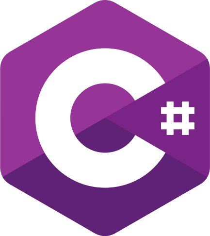

[](https://www.lightmattergame.com/)

# Temporal Fork

Temporal Fork is a unity implementation of Temporal Anti Aliasing, much of it is based on [Playdead's
 'temporal'
  solution](https://github.com/playdeadgames/temporal) hence the name 'fork'.

---

### No TAA


---

### With TAA


---

_Temporal Fork was developed for the published first person puzzle game [Lightmatter](https://www
.lightmattergame.com/)_

---

<p align="center" width="100%">
  <a href="https://unity3d.com/">
    
  </a>
  <a href="https://docs.microsoft.com/en-us/dotnet/csharp/index">
    
  </a>
</p>

## Notable Features

- ...
- ...

## Usage

- Edit your Unity projects "Packages/manifest.json" to include the string
  `"com.cnheider.temporal_fork": "https://github.com/cnheider/temporal_fork.git"}`.

  Example `manifest.json`
  ````
  {
    "dependencies": {
      "com.unity.package-manager-ui": "0.0.0-builtin",
      ...
      "com.cnheider.temporal_fork": "https://github.com/cnheider/temporal_fork.git",
    }
  }
  ````
  You can use `"com.cnheider.temporal_fork": "https://github.com/cnheider/temporal_fork.git#branch"` for a specific
   branch.

***Or***

- Download the newest TAA.unitypackage from [releases](https://github.com/cnheider/temporal_fork/releases
) and import into your Unity project.

***Or***

- Acquire the [Temporal Fork (Temporarily down)](http://u3d.as/14cC) package from the built-in asset store of
 the Unity Editor.

## Demo


## Repository Structure
---
<!--        ├  └  ─  │        -->
    cnheider/temporal_fork         # This repository
    │
    ├── Samples                  # Sample Project
    │
    ├── Editor                   # Editor Implementation
    │
    ├── Runtime                 # Runtime Implementation
    │
    ├── Documentation           # Unity Package Documentation
    │
    ├── Gizmos                  # Icons
    │
    ├── Tests                   # Tests
    │
    ├── .github                 # Images and such for this README
    │
    ├── LICENSE.md              # License file (Important but boring)
    ├── README.md               # The top-level README
    └── TUTORIAL.md             # Very quick tutorial to get you started
---

# Citation

For citation you may use the following bibtex entry:
````
@misc{temporalfork,
  author = {Heider, Christian},
  title = {Temporal Fork},
  year = {2020},
  publisher = {GitHub},
  journal = {GitHub repository},
  howpublished = {\url{https://github.com/cnheider/temporal_fork}},
}
````
